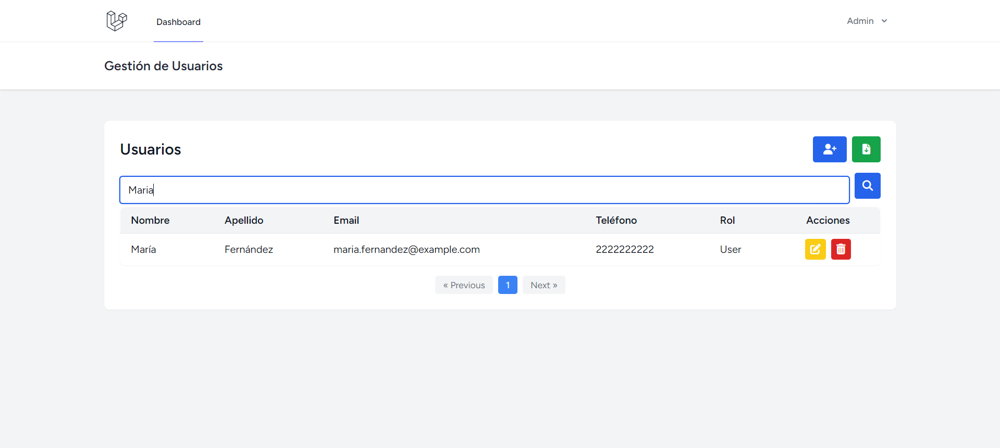
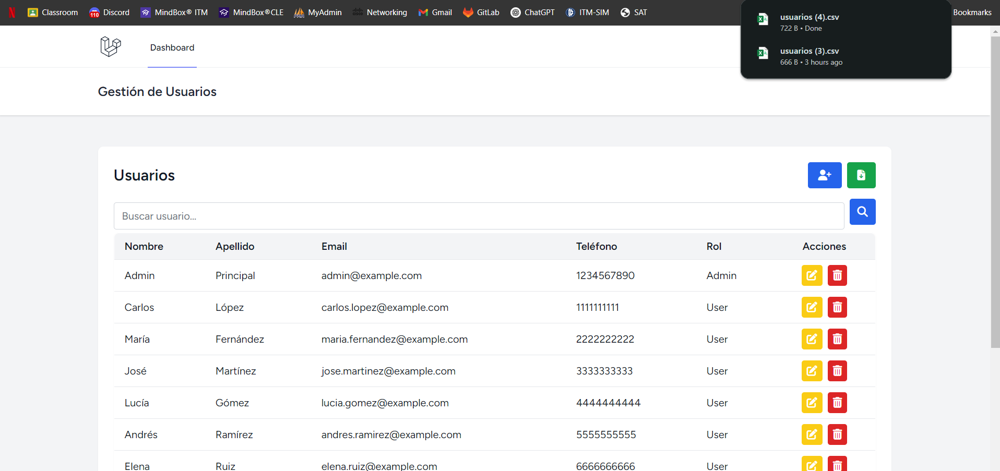
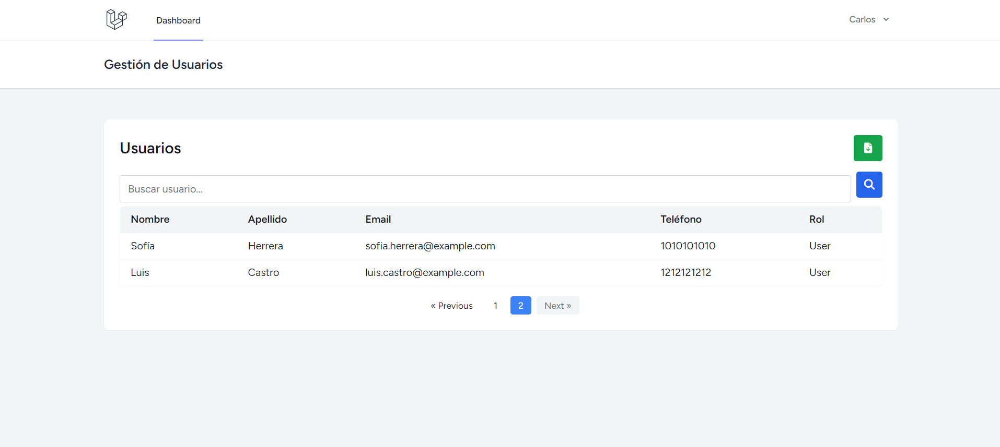

# Documentación del Proyecto CRUD de Usuarios con Laravel y Vue.js

# Consideraciones Iniciales

1. Instalar dependencias

Ejecuta estos comandos desde la raíz del proyecto para instalar las dependencias necesarias:

```bash
composer install
npm install
php artisan key:generate
```
2. Configurar el archivo .env

Por seguridad, el archivo .env no está incluido en el repositorio (está en .gitignore).

Copia el archivo de ejemplo y crea tu propio archivo .env,
ajusta las variables de entorno para tu gestor de base de datos. Si estás usando MySQL o MariaDB, puedes usar esta configuración como base:


```bash
DB_CONNECTION=mysql
DB_HOST=127.0.0.1
DB_PORT=3306
DB_DATABASE=user_management
DB_USERNAME=root
DB_PASSWORD=
```

Si usas PostgreSQL, asegúrate de crear la base de datos manualmente antes de correr las migraciones.

3. Ejecutar migraciones y seeders

Esto creará las tablas necesarias y poblará la base de datos con datos de ejemplo, incluyendo un usuario administrador y varios usuarios normales:

```bash
php artisan migrate --seed
```
4. Levantar los servidores de desarrollo

En dos terminales separadas, ejecuta los siguientes comandos para iniciar el backend y compilar el frontend:

``` bash

# Terminal 1 - Backend (Laravel)
php artisan serve

# Terminal 2 - Frontend (Vite con Vue)
npm run dev

```

5. Credenciales para acceso

Ya puedes acceder a la aplicación desde http://localhost:8000 con los siguientes usuarios:

``` bash

- Administrador

Email: admin@example.com
Contraseña: password

- Usuario estándar

Email: carlos.lopez@example.com
Contraseña: password

``` 


# Requisitos del Proyecto

### Este proyecto cumple con los siguientes requisitos funcionales y técnicos:

# Backend (Laravel)

1. Implementación de un sistema CRUD completo para gestionar usuarios con los campos: nombre, apellido, correo electrónico, contraseña, teléfono y rol.

2. Autenticación básica utilizando Laravel Breeze, lo que permite gestionar sesiones de usuarios registrados.

3. Middleware para verificar roles de usuario (Admin y User).

4. Exportación de registros de usuarios en formato CSV mediante un controlador.

# Frontend (Vue.js + Inertia)

1. Interfaz funcional e intuitiva usando Vue 3 y Inertia.js.

2. Formularios modales para crear y editar usuarios, con validaciones tanto en backend como mensajes de error en frontend.

3. Estilos implementados usando Tailwind CSS.

4. Sistema de paginación funcional.

# Base de Datos

1. Se utilizó MariaDB como sistema de gestión de base de datos.

2. Las migraciones para crear las tablas users y roles están definidas correctamente y ejecutadas con:

```bash

php artisan migrate --seed

```

Esto asegura que las tablas estén creadas y se poblaron con datos de ejemplo mediante seeders.

# Estructura del Proyecto

## Migraciones y Seeders

Las migraciones crean las tablas users y roles, incluyendo relaciones (FK) entre ellas.

El seeder RoleSeeder registra dos roles: Admin y User.

El seeder UserSeeder crea 12 usuarios: 1 con rol Admin y 11 con rol User.

Esto reinicia la base de datos, aplica las migraciones y ejecuta los seeders.

# Middleware de Roles

Se creó un middleware personalizado que verifica si el usuario autenticado tiene un rol para acceder a ciertas rutas:

```bash

public function handle(Request $request, Closure $next, ...$roles)
    {
        $usuario = $request->user();

        if (!$usuario || !$usuario->relationLoaded('role')) {
            $usuario->load('role');
        }

        $rolNombre = $usuario->role->name ?? null;

        if (!$rolNombre || !in_array($rolNombre, $roles)) {
            abort(403, 'No tienes permiso para acceder.');
        }

        return $next($request);
    }

```

Este middleware se aplica a las rutas protegidas dentro del archivo routes/web.php.

# Validación de Rutas

Se utilizaron los middleware auth y role:Admin según el nivel de acceso requerido. Esto garantiza que:

Solo usuarios autenticados accedan al dashboard.

Solo los administradores puedan crear, editar o eliminar usuarios.

Decisión sobre Roles y Permisos

Aunque se consideró el uso del paquete Spatie Laravel Permission para una gestión avanzada de roles y permisos, se decidió no incluirlo en este proyecto por simplicidad. A pesar de que Spatie ofrece escalabilidad, se optó por una relación directa entre usuarios y roles, ya que cubre los requisitos actuales sin agregar complejidad innecesaria. Se realizaron las modificaciones necesarias en los formularios de Breeze utilizando los datos originales; sin embargo, no se permitió que un usuario común pudiera asignarse un rol, ya que por defecto es registrado como 'user'.

# Frontend (Vue 3 + Inertia + Tailwind)

## Componentes Vue

### El sistema cuenta con componentes para todas las acciones CRUD:

- UserModal.vue para crear usuarios.

- UserUpdate.vue para editar usuarios.

- ConfirmDeleteModal.vue para confirmar eliminaciones.

- pagination.vue para gestionar la navegación entre páginas.

### Validación Visual

Cuando el backend detecta errores de validación, estos son retornados por Inertia y mostrados en el formulario correspondiente.

Control de Acceso Visual

Desde el frontend, se evalúa la prop isAdmin (enviada desde el backend) para mostrar u ocultar botones de acción:

<v-if="isAdmin">

Esto asegura que los usuarios con rol User solo puedan consultar los datos, sin posibilidad de modificarlos.


# Muestras del funcionamiento del sistema CRUD.

## Vista del administardor.  (Read)




## Registrar. (Create)


## Editar (Update)


## Eliminar (Delete)


## Exportar 



# Vista como  usuario autentificado




